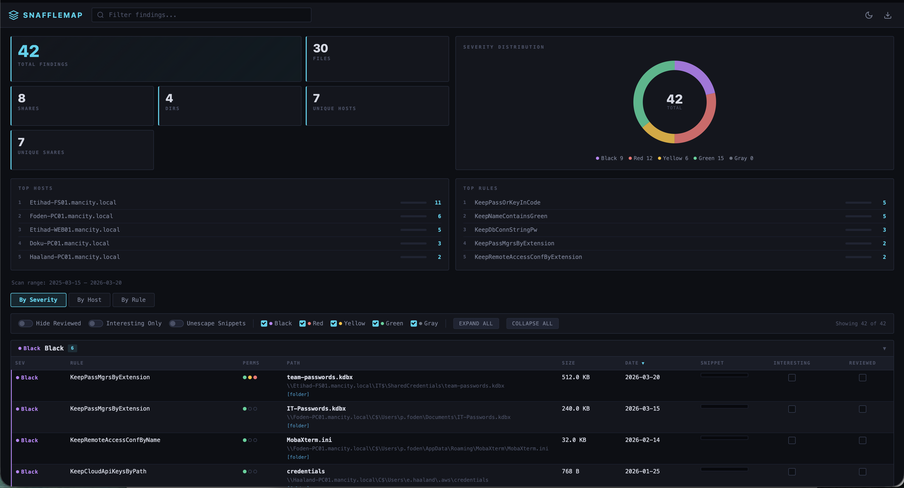

# SnaffleMap

Parse, filter, and export [Snaffler](https://github.com/SnaffCon/Snaffler) output.



Reads both TSV (`-y` flag) and JSON (`-t JSON` flag) formats. Filters, sorts, deduplicates, and exports to text, CSV, static HTML, or a self-contained interactive HTML report.

## Install

Run it directly:

```bash
uvx git+https://github.com/dejisec/SnaffleMap results.tsv --format report
```

Or install:

```bash
pipx install git+https://github.com/dejisec/SnaffleMap
pip install git+https://github.com/dejisec/SnaffleMap
```

## Usage

```bash
# Parse TSV and export a formatted text summary
snafflemap results.tsv

# Generate an interactive HTML report
snafflemap results.tsv --format report --output-dir ./results

# Focus on the high-severity stuff
snafflemap results.tsv --severity Black,Red --format report

# Filter by keyword and file extension
snafflemap results.tsv --keyword password --ext .kdbx,.pfx --format csv

# Export everything at once
snafflemap results.tsv --format all --output-dir ./results
```

Run `snafflemap --help` for the full list of filters, sort options, and output modes.

## Export Formats

| Format | Flag | What you get |
|--------|------|--------------|
| TXT | `--format txt` | ASCII tables grouped by severity |
| CSV | `--format csv` | Full-data export for Excel/pandas |
| HTML | `--format html` | Static styled table, no JavaScript |
| Report | `--format report` | Interactive single-file report |
| All | `--format all` | All of the above |
