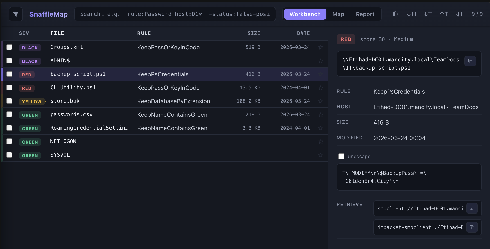

# SnaffleMap

Parse, filter, and export [Snaffler](https://github.com/SnaffCon/Snaffler) output.



It reads both TSV (`-y` flag) and JSON (`-t JSON` flag), drops duplicates, then filters and sorts what's left. Export to text, CSV, static HTML, or a single-file interactive report.

## Install

Run it directly:

```bash
uvx git+https://github.com/dejisec/SnaffleMap results.tsv --format report
```

Or install:

```bash
pipx install git+https://github.com/dejisec/SnaffleMap
pip install git+https://github.com/dejisec/SnaffleMap
```

## Usage

```bash
# Parse TSV and print a formatted text summary
snafflemap results.tsv

# Generate an interactive HTML report
snafflemap results.tsv --format report --output-dir ./results

# Focus on the high-severity stuff
snafflemap results.tsv --severity Black,Red --format report

# Filter by keyword and file extension
snafflemap results.tsv --keyword password --ext .kdbx,.pfx --format csv

# Export everything at once
snafflemap results.tsv --format all --output-dir ./results

# Merge several Snaffler runs into one named report
snafflemap run1.tsv run2.tsv host3.json --name engagement --format report

# Emit a JSONL baseline (round-trippable; feeds delta mode later)
snafflemap results.tsv --format jsonl --name baseline

# CI gate: exit 2 if any Black/Red findings remain
snafflemap results.tsv --fail-on Black,Red --quiet

# Re-rank by exploitability and keep only the high-value quick wins
snafflemap results.tsv --min-score 50 --sort-by score --format report

# Show only Critical-tier findings as JSONL (with detectors and extracted creds)
snafflemap results.tsv --tier Critical --format jsonl

# Add your own detectors and extractors on top of the built-ins
snafflemap results.tsv --catalog my-detectors.toml --format jsonl
```

Run `snafflemap --help` for the full list of filters, sort options, and output modes.

## Export Formats

| Format | Flag | What you get |
|--------|------|--------------|
| TXT | `--format txt` | ASCII tables grouped by severity |
| CSV | `--format csv` | Full-data export for Excel or pandas |
| HTML | `--format html` | Static styled table, no JavaScript |
| Report | `--format report` | Interactive report in one file |
| JSONL | `--format jsonl` | One finding per line (with a stable `id`), round-trippable |
| Evidence | `--format evidence` | Deliverable Markdown plus print-ready HTML (one file per finding with `--evidence-split`); redact with `--redact` |
| All | `--format all` | All of the above |

## Engagement Workflows

### Delta / Diff Mode

To track what changed between Snaffler runs, diff a scan against a JSONL baseline. Each finding gets labeled `new`, `persisted`, `escalated`, or `resolved`, and a summary line goes to stderr.

```bash
# Retest: diff this scan against previous JSONL baseline
snafflemap new.tsv --delta week1.jsonl --format report

# Only what's new since the baseline
snafflemap new.tsv --delta week1.jsonl --delta-only new --format jsonl
```

When you pass `--delta`, the report keeps each finding's delta status. You can query it in the workbench with `delta:new`, `delta:escalated`, `delta:persisted`, or `delta:resolved`.

### Evidence Packs

```bash
# Deliverable evidence pack (Markdown + print-ready HTML), secrets masked
snafflemap results.tsv --format evidence --redact partial --tier Critical,High

# One file per finding (useful for ticket-per-finding workflows)
snafflemap results.tsv --format evidence --evidence-split

# No redaction (internal use)
snafflemap results.tsv --format evidence --redact none
```

`--redact` options:

| Value | Behaviour |
|-------|-----------|
| `none` (default) | Secrets printed as-is |
| `partial` | First and last two characters shown; the middle becomes `…` |
| `full` | Secret replaced with `[REDACTED]` |

Note: `--format evidence` is left out of `--format all` on purpose.

## Interactive Report

The interactive report (`--format report`) is one HTML file with no external dependencies. It has three modes, a dark/light theme toggle, and triage state that survives reloads and can be passed between operators.

### Workbench

Type into the query bar and the findings list updates live. Queries mix free text with typed filters:

```
rule:KeepPass host:DC01 share:SYSVOL path:*.kdbx ext:kdbx
status:confirmed-loot sev:black|red score:>50 size:>1mb
type:share crackable:true delta:new
```

A slide-over facet rail counts findings by severity, host, share, rule, and type; click a facet to add it to the query. The rail also holds saved views, both built-in presets and queries you've saved yourself. Pick a finding and a detail pane opens: the snippet with the match highlighted (and an optional unescape), detector actions, loot-retrieval commands, and inline triage controls. Retrieval covers `smbclient` and `impacket-smbclient`; crackable findings also get a detector-specific command like `gpp-decrypt` or `hashcat`.

### Map

The Map view draws every host, share, and loot file as a collapsible tree. Each node has a severity-colored dot and a count badge. Click a host or share to filter the workbench down to that node.

### Report mode

A narrative rendering that prints and exports to PDF cleanly, meant to hand off as a deliverable.

### Triage

Every finding has a status (`new`, `triaged`, `confirmed-loot`, `false-positive`, or `reported`), a star, and timestamped notes. State is keyed on a stable `finding_id` derived from the path, so it survives re-runs. Bulk-select to set status or toggle stars across many findings at once.

**Export / import:** download a `triage-<name>.json` sidecar, or import and merge one from another operator (last write wins by `updated_at`; notes get unioned). You can also pre-bake a sidecar at ingest time:

```bash
# Re-open last week's triage on a fresh scan (carried by finding_id)
snafflemap new.tsv --triage week1-triage.json --format report
# Apply a reusable suppression list
snafflemap results.tsv --suppress org-suppressions.json --format report
```

**Suppression:** suppress findings by rule name — they're hidden by default and exported with the sidecar, so you can share a reusable org-level list through `--suppress`. (The sidecar format also carries `path`-glob and `detector`-id suppressions, but only rule-name suppressions are currently applied in the report.)

### Loot-script export

Download a ready-to-run bash script covering every file finding currently in the filter, or just the ones you selected. Each file gets `smbclient` and `impacket-smbclient` retrieval commands.

---

## Detection & Scoring

SnaffleMap matches findings against a built-in catalog of patterns worth chasing:
GPP cpassword, KeePass, private keys, web.config and appsettings, unattend,
AWS credentials and Azure publish settings, kubeconfig, and more. When it can, it pulls
out the credential and assigns an exploitability score (0-100) and a tier
(Critical/High/Medium/Low). Filter with `--min-score` or `--tier`, sort with
`--sort-by score`, and add your own patterns with `--catalog custom.toml`. The
JSONL export includes the full `enrichment` block.
